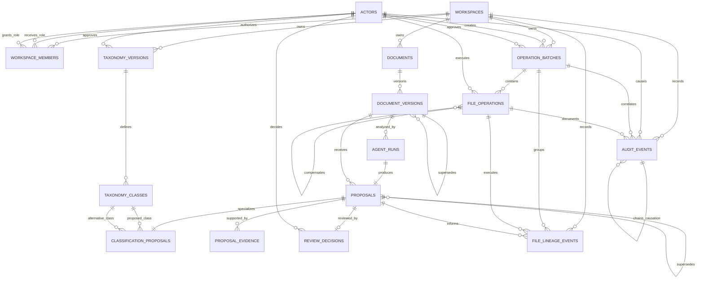

# DocWeave

DocWeave is a human-governed multi-agent document-management system for the
CockroachDB x AWS Hackathon — Build with Agentic Memory.

The product is designed to discover large PDF collections, classify documents,
propose meaningful names and destinations, identify related records, execute
approved copy or move operations, and safely restore prior states. CockroachDB
is the persistent operational, semantic, episodic, and preference memory. The
complete judged product will run on Amazon Web Services.

## Current status

DocWeave is in the approved requirements and architecture phase with an initial
local Python engineering scaffold, deterministic local filesystem discovery
contracts, local content fingerprinting, PDF signature inspection, and
deterministic intake records with duplicate grouping, and safe file-operation
planning, approval, single-operation execution, bounded local batch execution,
per-item results, in-memory idempotency, interrupted-operation reconciliation,
and append-only local audit event contracts. A typed CockroachDB operation
persistence adapter now defines atomic batch, execution-intent, terminal-result,
and hash-chained audit writes with bounded serializable retry behavior. An
optional lifecycle recorder now orders durable intent before filesystem
mutation and durable results after mutation, failing closed at both
boundaries. A restart-aware ledger can now load one workspace-scoped terminal
result or execution claim, replay completed work, reject active leases, and
route expired claims through filesystem reconciliation. A side-effect-free
runtime composer now assembles the transaction runner, repository, ledger,
recorder, and execution hooks around a caller-supplied engine without opening a
connection. The first non-vector CockroachDB migration is validated offline and
against a clean, isolated live validation database. No configured runtime
engine connects these boundaries to that schema, so durable application
persistence is not yet claimed. No runtime database integration, restore, AWS
workload, complete review interface, or intelligent document analysis is
claimed yet. The read-only PySide6 desktop entrypoint now opens the definitive
cockpit surface supplied for DocWeave, preserving its transparent frameless
console geometry while replacing demonstration content with compatible local
DocWeave state. It exposes authorized-folder selection, non-blocking local
discovery, deterministic intake counts, phase-aware progress, cooperative
cancellation, explicit in-memory workspace state, a real discovered-PDF table,
safe user-initiated opening of ready PDFs in the central embedded read-only
preview, local remembrance of the last successfully authorized folder for the
next folder picker, and confirmed and policy-validated delegation of eligible
PDF hyperlinks to the user's default browser. The cockpit now displays sanitized
runtime readiness for CockroachDB configuration and the approved Amazon Bedrock
client without exposing connection values or performing startup I/O. The
`ANALYZE` control now builds a bounded batch from visible ready PDFs, validates
each item under the authorized root, and dispatches the batch to a background
classification worker using the same configured runtime path. Each accepted
proposal moves its document into non-authoritative human review state in the
cockpit, with progress and terminal batch status surfaced without changing any
file. Per-item classification failures are reported without stopping the
remaining visible ready documents, and failed items remain ready for a later
explicit retry. The cockpit also prepares a deterministic, non-mutating mass
rename/move preview from the model-proposed class, validated candidate metadata
when available, and a sanitized original filename fallback, then binds it to
the existing safe file-operation planner so unsafe paths remain blocked before
any future approval. The shared operation core now exposes a file-lineage row
contract that separates original directory and filename, previous directory and
filename, and next directory and filename for each append-only operation
transition. It also blocks duplicate destination targets inside the same mass
preview before any human approval or file mutation. This is still a transparent
planning layer, not free-form semantic Bedrock filename generation. The shared
local operation core now includes explicit human review-decision contracts for
non-authoritative classification proposals. Decisions are attributable, fingerprint-bound to the
exact proposal and optional operation plan that was reviewed, and append-only in
the local test ledger. The cockpit now exposes local APPROVE and REJECT controls
for selected review rows, records the decision against the retained proposal
fingerprint, and visibly confirms that no copy or move has been executed. These
controls are not yet wired to CockroachDB and do not execute approved
filesystem operations. A third non-vector CockroachDB migration and typed
repository now define atomic, idempotent persistence for final approve/reject
review decisions, binding each decision to the exact proposal fingerprint and
optional operation-plan fingerprint while updating the proposal status in the
same transaction. Automated tests exercise a 30-PDF cockpit batch with an
injected non-cloud function, and live desktop classification remains dependent
on runtime configuration and a migrated database.
Document-controlled persistence values remain bound parameters rather than
executable Structured Query Language.

The shared core now also performs real page-level text extraction through the
already pinned Qt PDF module. Each attempt runs in a disposable child process
with authorized-root validation, source-digest verification, and explicit
file, page, character, and timeout budgets. Malformed, encrypted, unsupported,
changed, and text-free documents receive explicit states. This is parser
failure isolation, not a malware scanner or operating-system sandbox. Extracted
text is not yet sent to Bedrock or persisted in CockroachDB.

The `classification.v1` boundary now builds bounded Converse request fields,
uses a forced side-effect-free emission envelope, and validates classification
proposals against deterministic evidence segments and exact local quotations,
the approved taxonomy version, closed object shapes, and cross-reference
rules. A pinned boto3 Bedrock Runtime gateway can submit that contract through
an injected client and record observed tokens, latency, retries, stop reason,
request identity, and an optional externally priced cost estimate. It is not
wired into application startup. A bounded Nova 2 Lite run on one synthetic PDF
completed real extraction, model invocation, evidence reconstruction, and
validation. This proves the integration slice, not classification quality or
production readiness.

A second non-vector CockroachDB migration and typed repository define the
atomic, idempotent persistence of a validated Bedrock agent run, one
non-authoritative classification proposal, minimized evidence excerpts, and
runtime provenance. Model and document values remain bound SQL parameters, and
the schema deliberately omits canonical classifications until the promotion
workflow is implemented. Runtime wiring, document registration, taxonomy
initialization, and an uncalibrated scoring boundary are implemented locally. A
side-effect-free application runtime configuration
boundary can now compose the CockroachDB SQLAlchemy engine, approved Bedrock
Runtime client, validated Bedrock gateway, and classification runtime from
explicit environment values without opening a database connection or invoking a
model during startup. The `docweave-classify-pdf` command now exposes the first
controlled single-PDF runtime slice for real extraction, Bedrock invocation,
and CockroachDB persistence when those runtime values and a migrated database
are supplied. The `docweave-classify-batch` command extends the same explicit
runtime path to a bounded recursive PDF batch of up to 1,000 files under an
authorized root. It uses stable per-file idempotency keys, reports sanitized
per-document success or failure, and never mutates source files. Live
end-to-end database execution remains pending.

The `docweave-review-proposal` command adds the first durable human-review
runtime boundary. It persists one approved or rejected decision for an existing
proposal using the retained proposal fingerprint and configured reviewer actor,
without executing file operations. The cockpit now carries the persisted
proposal identity forward from classification results and can use the same
review-decision boundary when a real proposal ID is available. Durable review
decisions can also append a human-attributed audit event in the same
transaction.

A fourth non-vector CockroachDB migration now defines append-only
`file_lineage_events` memory for original, previous, and next directory and
filename state. A typed repository persists one lineage row atomically and
idempotently with optional proposal, operation batch, and file-operation
references. The `docweave-file-lineage` command composes the same configured
runtime and can record or list lineage rows against a migrated CockroachDB
target without exposing connection values. The cockpit now retains the
operation-preview lineage state for each reviewed proposal, including
original, previous, and next relative paths plus the plan fingerprint, and
surfaces that memory preview when the reviewer selects a proposal. This is
offline schema, adapter, command, and cockpit-preview evidence only: the
migration has not yet been applied to the live CockroachDB cluster, and
cockpit approval or execution is not yet wired to persist lineage rows
automatically.

The local shared core now also defines an explicit classification runtime that
keeps extraction, database transactions, and Bedrock invocation in separate
failure boundaries. It can register a verified PDF document version, install
or verify the approved workspace taxonomy with recorded human authority, invoke
the real validated Bedrock gateway, obtain scores from the versioned
pre-evaluation method or an explicitly injected later provider, and persist the
proposal. Runtime construction performs no database or model input/output. No
live end-to-end execution is claimed.

`confidence.raw.v0_1` now provides a deterministic pre-evaluation default for
review ordering. It uses validated ordinal model signals, extraction coverage,
evidence support, alternatives, contradictions, and missing expected evidence.
It never uses filenames or model-authored percentages, leaves calibrated
confidence null, and defines no automatic threshold. Corpus evaluation may
replace it with a later version without rewriting historical proposals.

An initial, explicitly labelled corpus of 30 synthetic two-page PDFs is
available in `pdf_sintetici` for desktop discovery, preview, guarded-link, and
later relationship testing. Its manifest records deterministic provenance,
expected categories, document relationships, page counts, and content hashes.
It is reference data, not model-generated analysis and not the planned final
evaluation corpus.

The current approved product direction includes:

- a complete PySide6 desktop application for authorized Windows folders;
- a complete cloud application using the same production agentic core;
- discovery of up to 10,000 files;
- up to 5,000 actively managed documents per Minimum Viable Product project;
- resumable processing batches of up to 1,000 documents;
- a representative demonstration corpus of approximately 300 synthetic PDFs;
- confidence-driven human review and high-confidence quality sampling;
- safe copy, move, and restore operations with append-only history;
- complete attribution for operators, reviewers, agents, and project managers;
- a relational-first CockroachDB design with meaningful vector retrieval.

## Documentation

Start with the [requirements index](docs/requirements/README.md).

## Runtime commands

The desktop shell is launched with:

```powershell
docweave-desktop
```

The first controlled classification runtime slice is launched with:

```powershell
docweave-classify-pdf <pdf-path> --authorized-root <folder>
```

Bounded batch classification uses the same explicit runtime path:

```powershell
docweave-classify-batch <folder> --authorized-root <folder> --limit 1000
```

Use `--json-report <path>` to write a sanitized machine-readable validation
artifact. Existing report files are not overwritten.

Durable review decisions for existing proposals are launched with:

```powershell
docweave-review-proposal --proposal-id <uuid> --action approve --proposal-fingerprint <sha256>
```

Durable file lineage memory can be inspected with:

```powershell
docweave-file-lineage list --logical-document-key <stable-document-key>
```

One lineage event can be recorded only with explicit, already reviewed path
state:

```powershell
docweave-file-lineage record --logical-document-key <stable-document-key> --lineage-sequence 1 --idempotency-key <stable-key> --action rename --original-relative-path incoming/a.pdf --previous-relative-path incoming/a.pdf --next-relative-path incoming/b.pdf --status succeeded --plan-fingerprint <sha256>
```

These commands require explicit runtime configuration through environment
variables. Classification commands perform real extraction, Amazon Bedrock
invocation, and CockroachDB writes only when invoked. Review and lineage
commands perform only their explicit CockroachDB writes or reads when invoked.
They do not create cloud resources, schemas, migrations, or secrets.

Runtime configuration can be checked before invoking classification with:

```powershell
docweave-runtime-preflight
docweave-runtime-preflight --database
```

CockroachDB memory migrations can be validated without opening a database
connection with:

```powershell
docweave-live-memory-validation
```

The configured CockroachDB memory layer can also be inspected read-only with:

```powershell
docweave-memory-evidence
docweave-memory-evidence --workspace-id <uuid> --json
```

The report verifies the Alembic revision, required DocWeave memory tables, and
table counts. The optional workspace filter is applied only to tables that have
a direct `workspace_id` column. The command never invokes Amazon Bedrock, writes
database rows, changes schemas, mutates files, or prints connection values.

When `DOCWEAVE_DATABASE_URL` is already supplied by the approved runtime
launcher or the current shell, the same command can explicitly inspect or
upgrade the configured target:

```powershell
docweave-live-memory-validation --inspect-live
docweave-live-memory-validation --online-upgrade --inspect-live
```

The validation command prints only sanitized migration and schema evidence. It
does not invoke Amazon Bedrock, process documents, create cloud resources, or
print connection values.

The default command validates configuration and Bedrock client construction
without opening external services. The `--database` form opens the configured
CockroachDB target and checks that the current non-vector DocWeave schema
tables needed by classification, review, and file-lineage persistence are
present.

The cockpit surfaces the same fail-closed runtime readiness categories in its
connection-state panel at startup. This is still a configuration preflight only:
the desktop does not open CockroachDB, invoke Bedrock, create cloud resources,
or write application rows until the user starts an explicit analysis action
with the required runtime values present. That action may process multiple
ready PDFs sequentially, bounded by the MVP processing-batch limit.

## CockroachDB schema map

DocWeave stores the currently implemented memory tables in the `docweave`
database under the `docweave` SQL schema. In CockroachDB Cloud, tables may not
appear if the console is focused on `defaultdb`, `public`, or only the query
builder output. Select the `docweave` database and inspect the `docweave`
schema, or run the schema-qualified inspection commands below.

```sql
SHOW DATABASES;
USE docweave;
SHOW SCHEMAS;
SHOW TABLES FROM docweave;
SHOW COLUMNS FROM docweave.documents;
SHOW CONSTRAINTS FROM docweave.documents;
```

The same table inventory can be checked through `information_schema`:

```sql
SELECT table_schema, table_name
FROM information_schema.tables
WHERE table_schema = 'docweave'
ORDER BY table_name;
```

Foreign keys can be inspected in a compact SQL Server Management Studio style:

```sql
SELECT
    tc.table_schema,
    tc.table_name,
    kcu.column_name,
    ccu.table_schema AS foreign_table_schema,
    ccu.table_name AS foreign_table_name,
    ccu.column_name AS foreign_column_name,
    tc.constraint_name
FROM information_schema.table_constraints AS tc
JOIN information_schema.key_column_usage AS kcu
    ON tc.constraint_name = kcu.constraint_name
    AND tc.table_schema = kcu.table_schema
JOIN information_schema.constraint_column_usage AS ccu
    ON ccu.constraint_name = tc.constraint_name
    AND ccu.table_schema = tc.table_schema
WHERE tc.constraint_type = 'FOREIGN KEY'
    AND tc.table_schema = 'docweave'
ORDER BY tc.table_name, kcu.ordinal_position;
```

The implemented physical schema, as of Alembic revision
`0004_file_lineage_memory`, is:



Implemented tables and their main relational role:

| Table | Primary key | Main foreign keys | Purpose |
| --- | --- | --- | --- |
| `docweave.workspaces` | `workspace_id` | none | Workspace boundary for all operational and memory records. |
| `docweave.actors` | `actor_id` | none | Human, service, and agent identities used for attribution. |
| `docweave.workspace_members` | `workspace_id`, `actor_id`, `role_code`, `granted_at` | `workspace_id` to `workspaces`, `actor_id` and `granted_by_actor_id` to `actors` | Workspace role grants and revocations. |
| `docweave.operation_batches` | `operation_batch_id` | `workspace_id` to `workspaces`, creator and approver actor IDs to `actors` | Human-approved copy or move batch envelope. |
| `docweave.file_operations` | `file_operation_id` | `(workspace_id, operation_batch_id)` to `operation_batches`, `executor_actor_id` to `actors`, `compensates_operation_id` to `file_operations` | Per-file planned, intended, terminal, and reconciled operation state. |
| `docweave.audit_events` | `workspace_id`, `event_sequence` | `workspace_id` to `workspaces`, `actor_id` to `actors`, batch and file-operation IDs to operation tables, previous and causation event IDs to `audit_events` | Append-only hash-chained audit chronology. |
| `docweave.documents` | `document_id` | `workspace_id` to `workspaces` | Logical document identity. |
| `docweave.document_versions` | `document_version_id` | `(workspace_id, document_id)` to `documents`, predecessor version to `document_versions` | Immutable content versions with digest and extraction state. |
| `docweave.taxonomy_versions` | `taxonomy_version_id` | `workspace_id` to `workspaces`, `approved_by_actor_id` to `actors` | Versioned classification taxonomy. |
| `docweave.taxonomy_classes` | `taxonomy_class_id` | `taxonomy_version_id` to `taxonomy_versions` | Class definitions available in a taxonomy version. |
| `docweave.agent_runs` | `agent_run_id` | `(workspace_id, document_version_id)` to `document_versions` | Durable Amazon Bedrock classification run provenance, metrics, and outcome. |
| `docweave.proposals` | `proposal_id` | `(workspace_id, document_version_id)` to `document_versions`, `(workspace_id, agent_run_id)` to `agent_runs`, superseded proposal to `proposals` | Non-authoritative agent proposal envelope. |
| `docweave.classification_proposals` | `proposal_id` | `proposal_id` to `proposals`, proposed and alternative classes to `taxonomy_classes` | Classification-specific proposal details and confidence components. |
| `docweave.proposal_evidence` | `proposal_evidence_id` | `(workspace_id, proposal_id)` to `proposals` | Minimized evidence excerpts and validation evidence for a proposal. |
| `docweave.review_decisions` | `review_decision_id` | `(workspace_id, proposal_id)` to `proposals`, `reviewer_actor_id` to `actors` | Append-only human approve, reject, request-change, or escalation decision. |
| `docweave.file_lineage_events` | `file_lineage_event_id` | `workspace_id` to `workspaces`, batch and file-operation IDs to operation tables, `proposal_id` to `proposals` | Append-only original, previous, and next directory and filename memory. |

Tables shown in the broader architecture diagrams but not listed here are
planned product schema, not implemented database objects. The authoritative
implemented schema is the Alembic migration chain under
[`migrations/versions`](migrations/versions).

Mandatory governance:

- [Project operating rules](PROJECT_RULES.md)
- [Competition rules and compliance guide](docs/requirements/competition-rules.md)
- [Product requirements](docs/requirements/product-requirements.md)
- [Domain and relational data requirements](docs/requirements/domain-data-requirements.md)
- [Minimum Viable Product scope and acceptance](docs/requirements/mvp-scope-and-acceptance.md)
- [Quality and security charter](docs/requirements/quality-security-charter.md)
- [Requirements traceability matrix](docs/requirements/requirements-traceability-matrix.md)

Approved architecture:

- [Amazon Bedrock primary-model decision](docs/architecture/decisions/0001-amazon-bedrock-primary-model.md)
- [CockroachDB physical-data-model decision](docs/architecture/decisions/0002-cockroachdb-physical-data-model.md)
- [CockroachDB migration-tooling decision](docs/architecture/decisions/0003-cockroachdb-migration-tooling.md)
- [Isolated PDF text-extraction decision](docs/architecture/decisions/0004-isolated-pdf-text-extraction.md)
- [Classification v1 structured-contract decision](docs/architecture/decisions/0005-classification-v1-contract.md)
- [Bedrock classification-gateway decision](docs/architecture/decisions/0006-bedrock-classification-gateway.md)
- [Uncalibrated confidence v0.1 decision](docs/architecture/decisions/0007-uncalibrated-confidence-v0.md)
- [Document-processing pipeline](docs/architecture/document-processing-pipeline.md)
- [CockroachDB physical-schema specification](docs/architecture/cockroachdb-physical-schema.md)
- [CockroachDB Entity Relationship model](docs/architecture/cockroachdb-entity-relationship.md)
- [CockroachDB operation persistence boundary](docs/architecture/cockroachdb-operation-persistence.md)
- [CockroachDB classification persistence boundary](docs/architecture/cockroachdb-classification-persistence.md)
- [CockroachDB review decision persistence boundary](docs/architecture/cockroachdb-review-decision-persistence.md)
- [Desktop discovery shell](docs/architecture/desktop-discovery-shell.md)
- [Verified AWS and CockroachDB environment baseline](docs/operations/environment-baseline.md)
- [Runtime configuration runbook](docs/operations/runtime-configuration-runbook.md)
- [CockroachDB live validation evidence](docs/operations/cockroachdb-live-validation.md)
- [Bedrock live classification validation](docs/operations/bedrock-live-validation.md)
- [Delivery plan](docs/operations/delivery-plan.md)

## Repository policy

- Repository artifacts and submission material are written in English.
- Architecture and implementation require explicit approval.
- Intelligent behavior must be genuine, observable, and evaluated.
- Private reference data, credentials, and real company documents must never be
  committed.
- Material changes are developed on branches and reviewed through pull
  requests.

## Local development

The Python scaffold does not connect to a database by default. Its non-vector
CockroachDB migrations are rendered and tested offline; live validation
evidence is documented separately. A validation schema is not a runtime or
production deployment. The scaffold establishes reproducible local quality
gates before durable application wiring is enabled.

Create a virtual environment, install the pinned development tools, and run the
local checks:

```powershell
python -m venv .venv
.\.venv\Scripts\python -m pip install -r requirements-lock.txt
.\.venv\Scripts\python -m pip install -e . --no-deps
.\scripts\check.ps1
```

Launch the initial read-only desktop discovery shell:

```powershell
.\.venv\Scripts\docweave-desktop.exe
```

On Windows, the same dashboard can also be started by double-clicking
`launch-docweave-dashboard.cmd` in the repository root. When the local
runtime launcher exists under the user's DocWeave application-data directory,
the repository launcher delegates to it so the dashboard inherits the explicit
runtime environment already configured outside the repository. Otherwise it
falls back to the repository-local virtual environment. It does not embed
runtime credentials or cloud configuration.

The shell does not yet connect to CockroachDB or Amazon Bedrock, does not
persist scan results or document analysis by default, and does not modify
files. It only remembers the last successfully authorized folder path in the
local desktop settings store so the next folder picker starts there.

## License

A competition-compatible open-source license will be selected explicitly before
the repository is made public. No license is implied at this stage.
