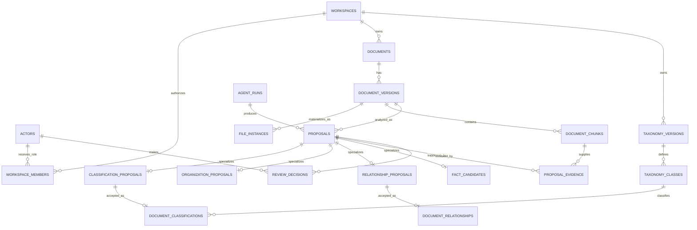
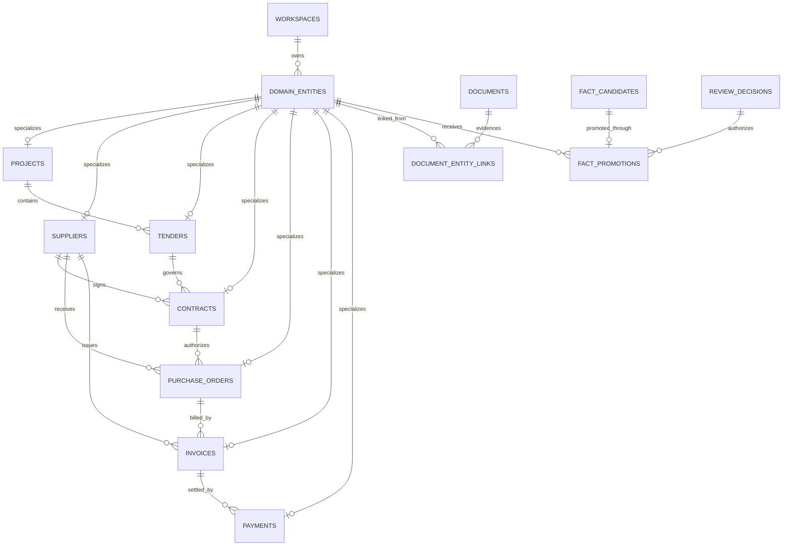
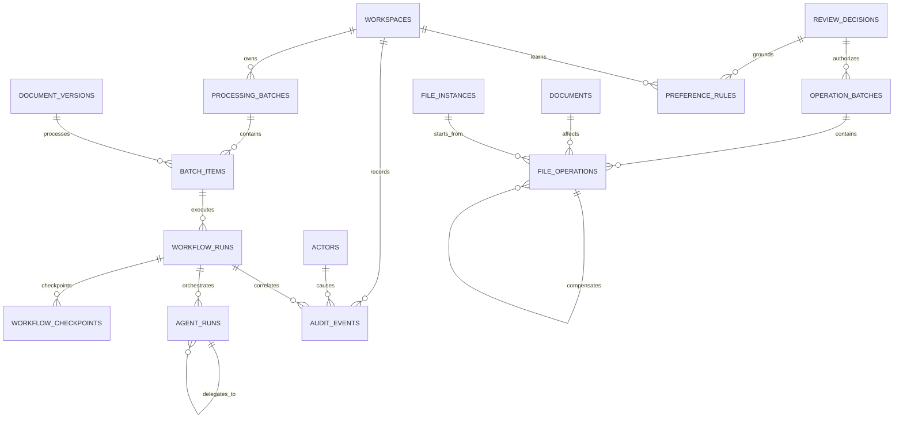

# CockroachDB Entity Relationship Model

**Project:** DocWeave
**Version:** 0.1
**Decision status:** Approved by ADR-0002
**Implementation status:** Not started

## Purpose

This diagram shows the principal relational boundaries approved for DocWeave.
It intentionally omits some descriptive columns so that identity, provenance,
review, workflow, and canonical-state relationships remain readable.

## Core document and proposal model

## Canonical domain model

## Workflow, operation, and memory model

## Invariants represented by the model

- A physical file instance belongs to one exact document version.
- A document version may have multiple local or cloud instances.
- Every intelligent subtype has one proposal identity and one producing agent
  run.
- Every canonical classification, relationship, or promoted fact retains its
  source proposal and human decision.
- Every canonical business entity has one typed subtype.
- A file operation is authorized before execution and may be compensated by a
  later operation without deleting history.
- Workflow checkpoints and agent runs remain connected to the same durable
  document and workspace identities.
- Preference memory is grounded in attributable decisions and can be revoked or
  superseded.

## Deliberate omissions

The diagram does not imply:

- that every table is writable by every application role;
- that a model may promote facts without review;
- that file operations are atomic with SQL;
- that vector dimensions are already approved;
- that the current taxonomy discrepancy has been resolved; or
- that implementation or database creation has started.
