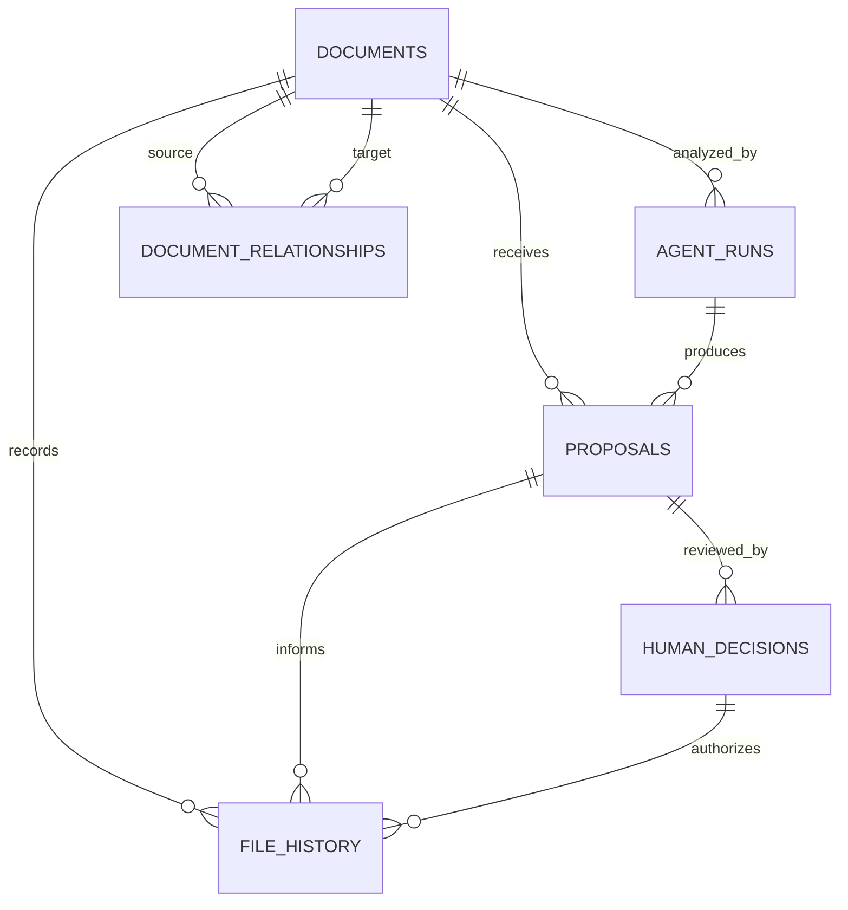

# CockroachDB Physical Schema

**Status:** Current hackathon schema  
**Last updated:** 2026-08-08

DocWeave uses one CockroachDB schema named `docweave`.

## Tables

| Table | Role |
| --- | --- |
| `documents` | Original and current file identity for each PDF. |
| `agent_runs` | Amazon Bedrock analysis attempts and model output. |
| `proposals` | Proposed class, destination folder, filename, confidence, and evidence summary. |
| `human_decisions` | Human approve, reject, or request-change decisions. |
| `file_history` | Before/after path memory for approved operations. |
| `document_relationships` | Optional links between documents. |

## Core Relationships



## Demo Query

```sql
SELECT
    d.original_directory,
    d.original_filename,
    h.previous_directory,
    h.previous_filename,
    h.next_directory,
    h.next_filename,
    h.status
FROM docweave.file_history AS h
JOIN docweave.documents AS d
    ON d.document_id = h.document_id
ORDER BY d.original_filename, h.event_sequence;
```

This is the primary CockroachDB memory proof for the hackathon demo.
